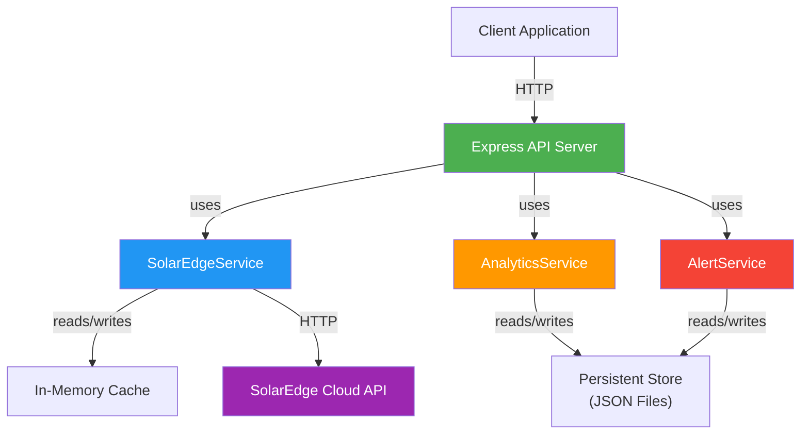
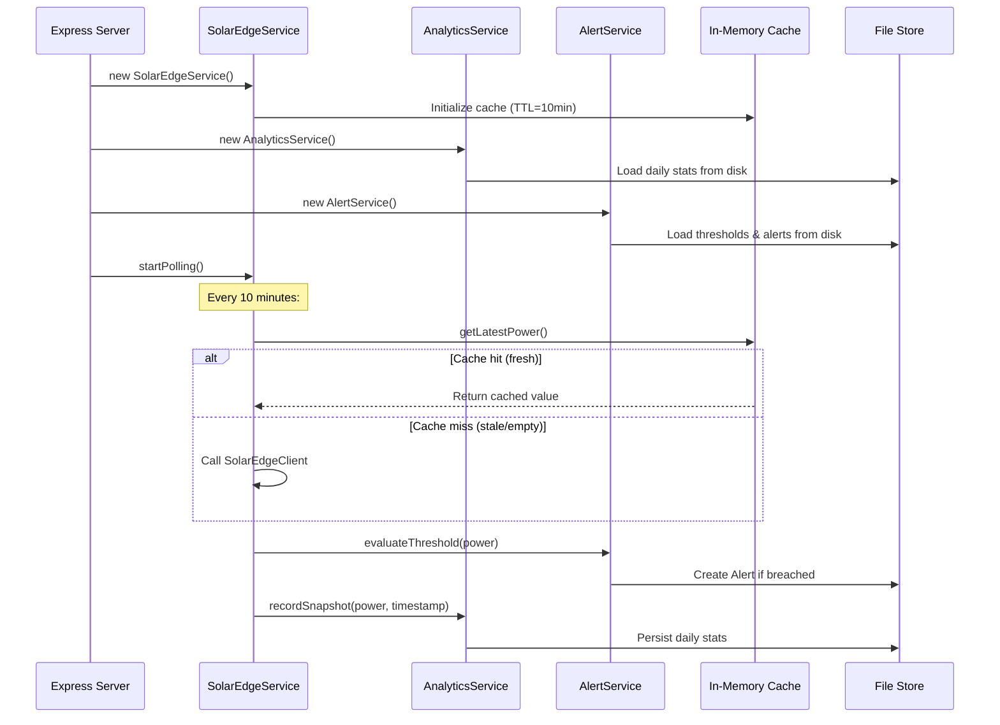
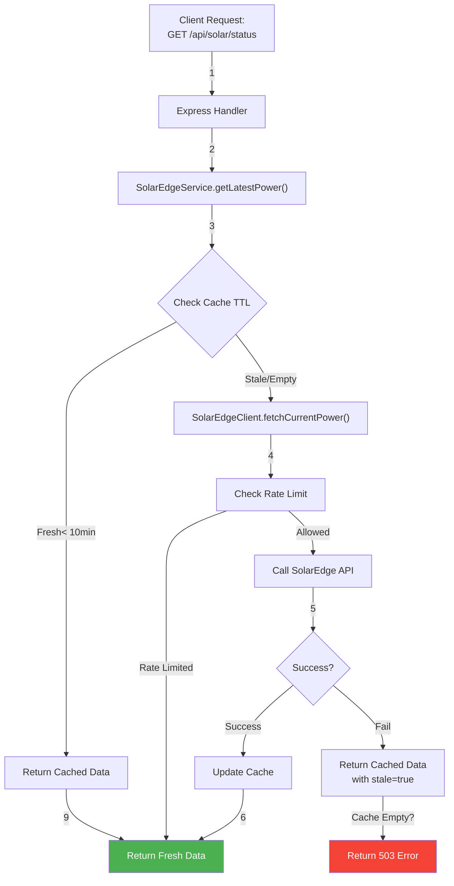
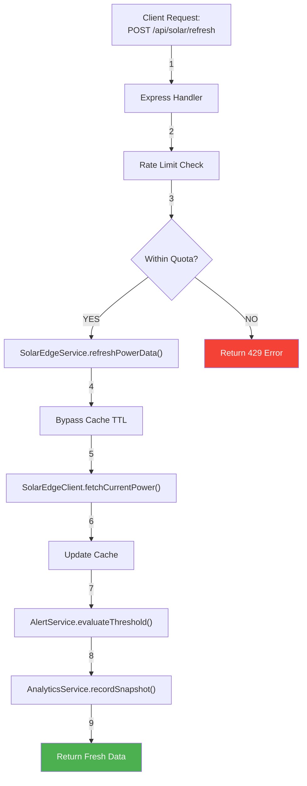
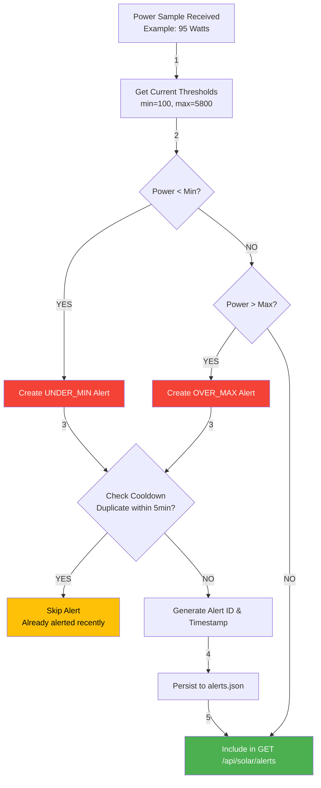
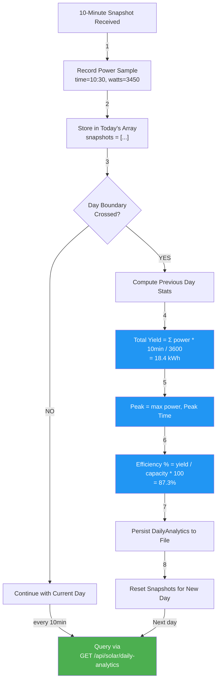
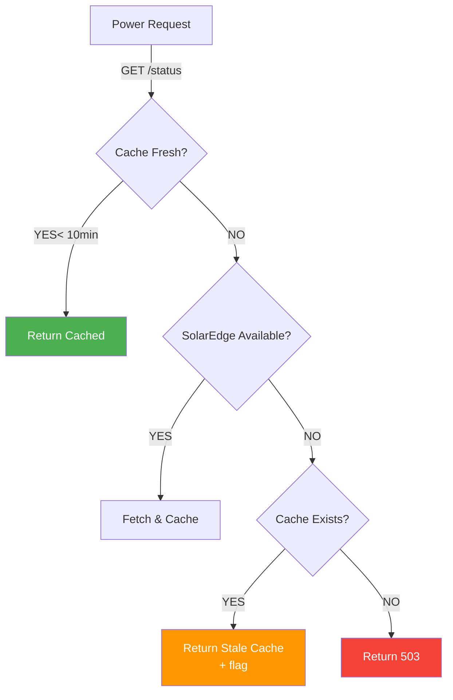

# Implementation Guide: SolarEdge Solar Monitoring API

This document provides a detailed walkthrough of the implemented flows, data structures, and architectural patterns for the Solar Monitoring system.

---

## Table of Contents

1. [High-Level Architecture](#high-level-architecture)
2. [Data Models](#data-models)
3. [Core Flows](#core-flows)
4. [Service Layer Details](#service-layer-details)
5. [API Contracts](#api-contracts)
6. [Error Handling](#error-handling)
7. [Testing Strategy](#testing-strategy)

---

## High-Level Architecture

### Component Diagram



---

## Data Models

### Core Domain Types

#### 1. SolarTelemetry (Real-Time Power Data)

```typescript
interface SolarTelemetry {
  timestamp: string;           // ISO-8601 timestamp
  currentPowerWatts: number;   // AC power output (Watts)
  totalYieldWh: number;        // Cumulative energy (Wh) from SolarEdge
  systemStatus: 'OK' | 'WARNING' | 'ERROR';
  inverterTemperature?: number; // Optional: inverter temp in Celsius
  efficiency?: number;          // Optional: AC/DC efficiency %
}
```

#### 2. DailyAnalytics (Aggregated Statistics)

```typescript
interface DailyAnalytics {
  date: string;                    // YYYY-MM-DD
  totalYieldKwh: number;           // ΣPower * 10min / 3600
  peakPowerWatts: number;          // max(power) for the day
  peakTimeUtc: string;             // ISO-8601 of peak
  efficiencyPercent: number;       // (totalYield / capacity) * 100
  snapshotCount: number;           // Number of 10-min samples
  systemCapacityWatts: number;     // Configured inverter capacity
  averagePowerWatts: number;       // Mean power for the day
  minPowerWatts: number;           // Minimum power recorded
}
```

#### 3. AlertThreshold & Alert

```typescript
interface AlertThreshold {
  minWatts: number;           // Minimum acceptable power
  maxWatts: number;           // Maximum acceptable power
  lastUpdated: string;        // ISO-8601 when thresholds were set
}

interface Alert {
  id: string;                 // UUID
  timestamp: string;          // ISO-8601 when breach occurred
  type: 'UNDER_MIN' | 'OVER_MAX';
  power: number;              // Actual power at breach
  threshold: number;          // Breached threshold value
  message: string;            // Human-readable description
  cooldownUntil?: string;     // ISO-8601 for duplicate suppression
}
```

#### 4. CacheEntry (Generic TTL Cache)

```typescript
interface CacheEntry<T> {
  value: T;
  timestamp: number;          // Unix milliseconds
  ttlMs: number;              // Time-to-live in milliseconds
}

interface CacheConfig {
  defaultTtlMs: number;       // Default TTL (e.g., 600000 for 10 min)
  maxEntries: number;         // Max items before eviction
}
```

---

## Core Flows

### Flow 1: Initialization & Polling Setup



---

### Flow 2: Real-Time Power Fetch (GET /api/solar/status)



---

### Flow 3: Manual Refresh (POST /api/solar/refresh)



---

### Flow 4: Alert Threshold Evaluation



---

### Flow 5: Daily Analytics Computation



---

## Service Layer Details

### SolarEdgeService

**Responsibilities:**
- Fetch current power from SolarEdge API or cache
- Manage 10-minute polling loop
- Handle cache TTL logic
- Rate-limit external API calls

**Key Methods:**

```typescript
class SolarEdgeService {
  // Get latest power (from cache if fresh, else fetch)
  async getLatestPower(): Promise<SolarTelemetry>
  
  // Manual refresh (bypass cache)
  async refreshPowerData(): Promise<SolarTelemetry>
  
  // Start automatic 10-min polling
  startPolling(intervalMinutes: number): void
  
  // Stop polling
  stopPolling(): void
  
  // Check if rate-limited
  private isRateLimited(): boolean
}
```

**Cache Strategy:**
- **TTL:** 10 minutes (600,000 ms)
- **Hit Scenario:** Power request within 10 min → return cached value
- **Miss Scenario:** Power request after TTL → fetch from SolarEdge
- **Manual Refresh:** Bypasses TTL, calls SolarEdge directly

---

### AnalyticsService

**Responsibilities:**
- Collect 10-minute power snapshots
- Compute daily aggregates (yield, peak, efficiency)
- Persist daily stats to disk

**Key Methods:**

```typescript
class AnalyticsService {
  // Record a power snapshot
  recordSnapshot(power: number, timestamp: Date): void
  
  // Compute stats for today
  computeDailyStats(): DailyAnalytics
  
  // Retrieve today's analytics
  getDailyAnalytics(): DailyAnalytics
  
  // Load historical stats from disk
  private loadDailyStats(): void
  
  // Persist to disk on day boundary
  private persistDailyStats(): void
}
```

**Computation Logic:**
```
Daily Yield (kWh) = Σ(power * interval / 3600)
                  where interval = 10 minutes = 600 seconds
                  e.g., 144 samples * avg 3500W * 600s / 3600
                      = 144 * 3500 * 0.167 = 84 kWh per 3500W avg
                      
Peak Power = max(power) across all 10-min samples

Efficiency % = (Daily Yield / System Capacity) * 100
             = (18.4 kWh / 6000W) * 100
             = 18.4 / 6 / 100 = 306% (if 6000W capacity for 1 hour)
             
Average Power = Σpower / sample_count
              = 3500W average across day
```

---

### AlertService

**Responsibilities:**
- Store min/max power thresholds
- Evaluate thresholds on each power update
- Generate & persist alerts
- Prevent duplicate alerts via cooldown

**Key Methods:**

```typescript
class AlertService {
  // Set power thresholds
  setThresholds(min: number, max: number): void
  
  // Get current thresholds
  getThresholds(): AlertThreshold
  
  // Evaluate power against thresholds
  evaluateThreshold(power: number, timestamp: Date): Alert | null
  
  // Get alerts for a specific date
  getAlerts(date?: string): Alert[]
  
  // Persist to disk
  private persistAlerts(): void
}
```

**Threshold Logic:**
```
If power < minWatts → UNDER_MIN alert
If power > maxWatts → OVER_MAX alert
If same breach type within cooldown (5 min) → SKIP (prevent spam)
Otherwise → Create new alert, persist, include in response
```

---

## API Contracts

### Request/Response Patterns

#### Status Check (Low Latency)

```
Request:  GET /api/solar/status
Response: 200 OK
Body: {
  timestamp: "2026-05-16T10:30:00Z",
  currentPowerWatts: 3450,
  systemStatus: "OK",
  lastFetchTime: "2026-05-16T10:30:00Z",
  cacheAge: "PT2M30S",
  stale: false
}
```

#### Manual Refresh (High Latency)

```
Request:  POST /api/solar/refresh
Response: 200 OK (or 429 Rate Limited)
Body: {
  timestamp: "2026-05-16T10:31:15Z",
  currentPowerWatts: 3455,
  systemStatus: "OK",
  refreshedAt: "2026-05-16T10:31:15Z",
  freshData: true
}
```

#### Daily Analytics

```
Request:  GET /api/solar/daily-analytics
Response: 200 OK
Body: {
  date: "2026-05-16",
  totalYieldKwh: 18.4,
  peakPowerWatts: 5200,
  peakTimeUtc: "2026-05-16T12:45:00Z",
  efficiencyPercent: 87.3,
  snapshotCount: 144,
  systemCapacityWatts: 6000,
  averagePowerWatts: 3500,
  minPowerWatts: 150
}
```

#### Alert History

```
Request:  GET /api/solar/alerts?date=2026-05-16
Response: 200 OK
Body: {
  date: "2026-05-16",
  alerts: [
    {
      id: "alert-001",
      timestamp: "2026-05-16T06:15:00Z",
      type: "UNDER_MIN",
      power: 85,
      threshold: 100,
      message: "System power fell below minimum threshold of 100W"
    },
    {
      id: "alert-002",
      timestamp: "2026-05-16T17:30:00Z",
      type: "OVER_MAX",
      power: 5850,
      threshold: 5800,
      message: "System power exceeded maximum threshold of 5800W"
    }
  ]
}
```

---

## Error Handling

### Error Categories

| Error | Status | Cause | Recovery |
|-------|--------|-------|----------|
| Invalid Input | 400 | Bad query/body params | Client retries with valid input |
| Rate Limited | 429 | >1 API call/min | Wait 60s, then retry |
| Unavailable | 503 | SolarEdge API down, cache empty | Retry after 60s |
| Internal Error | 500 | Unexpected exception | Log, alert, retry |

### Error Response Format

```json
{
  "error": "Rate limit exceeded",
  "message": "Maximum 1 refresh per minute allowed",
  "retry_after": 45,
  "timestamp": "2026-05-16T10:31:15Z"
}
```

### Graceful Degradation



---

## Testing Strategy

### Unit Tests by Service

#### SolarEdgeService Tests

```typescript
describe('SolarEdgeService', () => {
  it('should return cached power if TTL not expired')
  it('should fetch from API if cache expired')
  it('should bypass cache on manual refresh')
  it('should respect rate limit quota')
  it('should return stale data if SolarEdge unreachable')
  it('should throw error if cache empty and SolarEdge down')
})
```

#### AnalyticsService Tests

```typescript
describe('AnalyticsService', () => {
  it('should record snapshots throughout the day')
  it('should compute daily yield from snapshots')
  it('should calculate peak power and time correctly')
  it('should compute efficiency percentage')
  it('should persist stats on day boundary')
  it('should load historical stats from disk')
})
```

#### AlertService Tests

```typescript
describe('AlertService', () => {
  it('should detect UNDER_MIN breach')
  it('should detect OVER_MAX breach')
  it('should skip duplicate alerts within cooldown')
  it('should persist alerts to disk')
  it('should retrieve alerts by date')
  it('should allow updating thresholds')
})
```

#### Integration Tests

```typescript
describe('Solar API Integration', () => {
  it('GET /api/solar/status should return current power')
  it('POST /api/solar/refresh should fetch fresh data')
  it('GET /api/solar/daily-analytics should return aggregates')
  it('GET /api/solar/alerts should return threshold breaches')
  it('POST /api/solar/thresholds should update config')
  it('Full workflow: fetch → evaluate → store → retrieve')
})
```

### Coverage Target

- **Unit Tests:** >80% line coverage
- **Integration Tests:** All critical paths
- **E2E Tests:** TBD (requires deployed system)

---

## Monitoring & Observability

### Key Metrics

```typescript
interface SystemMetrics {
  cacheHitRate: number;           // % of requests served from cache
  apiCallCount: number;           // Total SolarEdge API calls today
  averageResponseTime: number;    // Mean latency in ms
  alertCount: number;             // Alerts generated today
  systemUptime: number;           // Seconds running
  lastSuccessfulFetch: string;    // ISO-8601 timestamp
}
```

### Logging

All services should log:
- **DEBUG:** Service initialization, cache hits/misses
- **INFO:** API calls, thresholds updated, alerts created
- **WARN:** Rate limit approaching, stale data returned
- **ERROR:** API failures, invalid config, unhandled exceptions

---

## Appendix: TypeScript Strict Mode

All code follows TypeScript strict mode:
- ✅ No `any` type
- ✅ All function parameters typed
- ✅ All return types annotated
- ✅ Strict null checks enabled
- ✅ `readonly` for immutable structures

Example:
```typescript
// ❌ NOT allowed
function fetchPower() { }

// ✅ Correct
function fetchPower(): Promise<SolarTelemetry> { }
async function getStatus(id: string): Promise<SolarTelemetry | null> { }
```

---

**Version:** 1.0  
**Last Updated:** May 16, 2026  
**Status:** Implementation in progress
